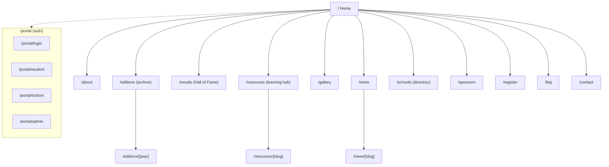
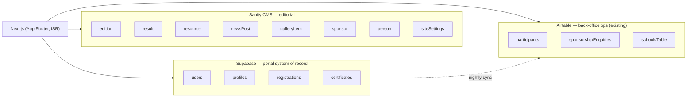
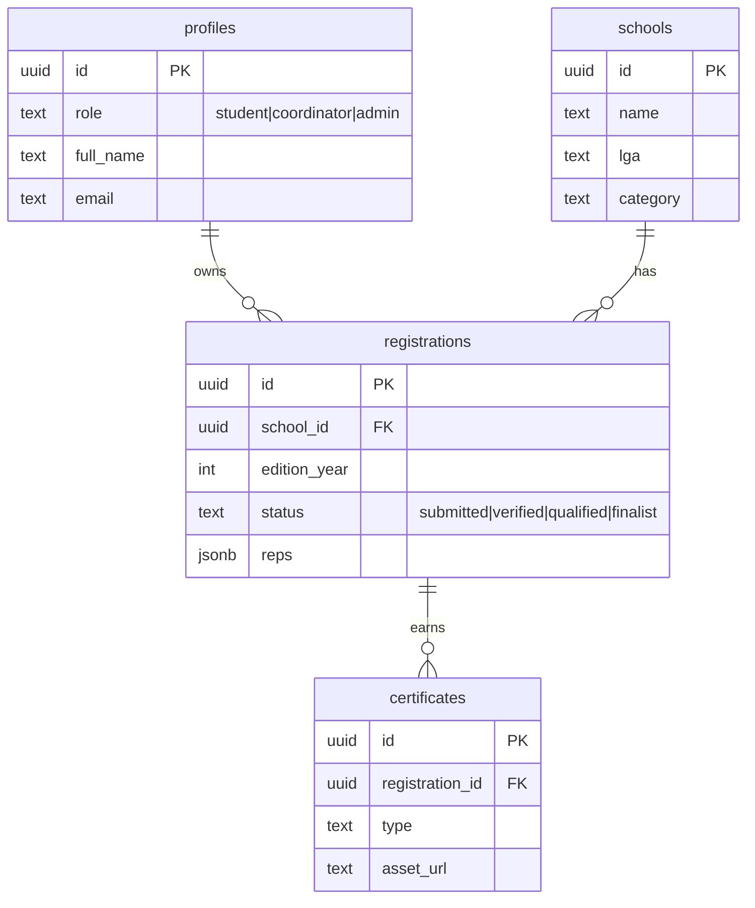
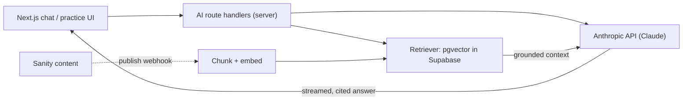

# ASC Platform — Architecture & Roadmap

Evolving the Adewale Students Conference site from a single-page ASC 2026 marketing page into a
recurring **STEM education platform**: multi-page content, a CMS editors control, an archive of past
editions/results, a learning-resources hub, and authenticated student/school portals.

> **Decisions locked in**
> - **Content source:** Sanity CMS (editorial content) + Airtable retained for form submissions.
> - **Scope:** all public content areas (Editions, Results, Resources, News, Gallery, Schools, Sponsors).
> - **Portals:** in scope — student + school/teacher + admin, with auth and a relational datastore.

---

## Recommended sequence & cost (start here)

Build in three milestones, ordered by value-per-risk and dependencies. Ship the public platform
first, prove it, then take on auth and AI. **AI is last on purpose** — it is the only cost that
scales with usage, so deferring it keeps spend predictable until there's an audience to justify it.

| Milestone | Phases (in order) | New recurring cost |
| --- | --- | --- |
| **M1 — Public platform** | 0 → 1 → 2 → 3 → 4 | **~$0** — free tiers + tools already in use |
| **M2 — Portals** | 5 → 6 → 7 → 8 | **~$25/mo fixed** (Supabase, once past free tier) |
| **M3 — AI** | A1 → A2 → A3 | **Variable** — Claude per-token + embeddings; gate behind a budget ceiling |

Cost detail by tool (approximate — verify current pricing when you reach each milestone):

| Tool | M1 | Note |
| --- | --- | --- |
| Vercel hosting | $0 (already there) | ~$20/mo only if Pro is needed |
| Sanity CMS (new) | $0 | Free tier; paid only with many editors / heavy bandwidth |
| Airtable, SendGrid | $0 new | Already in use |
| Supabase (M2) | $0 → ~$25/mo | Free tier first; fixed cost when outgrown |
| Claude + embeddings (M3) | usage-based | The only open-ended cost — set a monthly ceiling + per-student rate limits |

**Start with Phase 0.** It's mostly routing + layout + a content-system scaffold, reuses every existing
section, and unblocks everything else.

## 1. Audiences & goals

| Audience | What they need | Where it lives |
| --- | --- | --- |
| Prospective students / participants | What it is, how to enter, past winners, study resources | Public pages + Resources |
| Schools / teachers (coordinators) | Register a school, manage reps, track status, download materials | `/register` + **School portal** |
| Parents / public | Credibility: history, results, photos, news | Editions, Results, Gallery, News |
| Sponsors / partners | Impact, tiers, how to sponsor | `/sponsors` + enquiry form |
| Foundation staff (admin) | Publish editions/results/news, manage registrations, issue certificates | Sanity Studio + **Admin portal** |

## 2. Information architecture

The existing sections (Hero, About, Impact, Programme, Dates, FAQ, Sponsorship, Registration, Founder)
are reused: they become the **Home** highlights plus the `/about`, `/sponsors`, `/register`, `/faq`
pages. No section is discarded.

## 3. Data architecture

Three stores, each with a clear job:

- **Sanity** = editor-managed content. Pulled at build/ISR; great image pipeline; non-dev friendly studio.
- **Airtable** = keep for current form submissions and staff's existing ops workflow.
- **Supabase** (Auth + Postgres + Storage) = relational backbone for portals (logins, dashboards,
  certificates). Recommended because it bundles auth, DB, and file storage in one Vercel-friendly service.
  Alternative: Clerk (auth) + Neon (Postgres). _Decision needed at Phase 5 — see open questions._

### 3.1 Sanity content model (schemas)

- **edition** — `year`, `slug`, `theme`, `status (upcoming|active|completed)`, `startDate`, `endDate`,
  `heroImage`, `summary (portable text)`, `stats[] {label,value}`, `recap`, `gallery[] -> galleryItem`,
  `sponsors[] -> sponsor`.
- **result** — `edition -> edition`, `category`, `position`, `schoolName`, `studentNames[]`, `zone`, `score`.
- **resource** — `title`, `slug`, `type (past-question|study-guide|syllabus|video)`, `subject`,
  `level (SS1|SS2)`, `edition? -> edition`, `file (asset)` or `externalUrl`, `body`.
- **newsPost** — `title`, `slug`, `publishedAt`, `author -> person`, `coverImage`, `excerpt`, `body`, `tags[]`.
- **galleryItem** — `title`, `edition -> edition`, `media (image|video)`, `caption`.
- **sponsor** — `name`, `tier`, `logo`, `url`, `editions[]`.
- **person** — `name`, `role (founder|team|judge)`, `photo`, `bio`.
- **siteSettings** — nav, socials, contact, current edition pointer.

> **Schools directory:** Airtable's schools table stays the source of truth (it's tied to registration).
> `/schools` reads it directly — no duplication into Sanity.

### 3.2 Supabase schema (portals)

**Account ↔ registration linking:** on school registration, issue an access code (or match on
principal/teacher email) so a coordinator can claim their school's record in the portal. Students are
invited by their coordinator or self-register against a verified school.

## 4. Portal roles

| Role | Sees / does |
| --- | --- |
| **Student** | Own status, edition schedule, resources, results, downloadable certificate |
| **Coordinator (school/teacher)** | Manage school's reps, registration status, materials, school results |
| **Admin (staff)** | Publish results, issue certificates, view registrations. (Most content authored in Sanity Studio, not the portal.) |

Auth: Supabase email/password or magic link. Route protection via middleware on `/portal/**`.

## 5. Cross-cutting

- **Rendering:** SSG + ISR (`generateStaticParams` + `revalidate`) for all content pages; portal is dynamic/auth.
- **SEO:** per-page `metadata`, `sitemap.ts`, `robots.ts`, OG images, JSON-LD (`Organization`, `Event`).
- **Design system:** promote brand tokens (navy `#0A0F1E`, gold `#E8A020`, cream `#FAF7F0`, Bebas/Playfair)
  and shared primitives (Card, ArticleLayout, Gallery, StatBlock, PageHeader) into `src/components/ui`.
- **Media:** Sanity image pipeline for editorial; `next/image` everywhere.
- **Analytics:** Vercel Analytics or Plausible.
- **Email:** existing SendGrid confirmation flow extends to portal events (welcome, status changes, certificates).

## 6. AI layer

The platform's differentiator: a STEM **AI study companion** and authoring/marking
assists, all grounded in *your own* content so answers are trustworthy for students
(and safe for minors). AI is layered on **after** the Resources hub exists — there is
no corpus to ground against before then.

### 6.1 Capabilities (mapped to the platform)

| Capability | Who | What it does |
| --- | --- | --- |
| **AI study companion** | Student | Chat/Q&A grounded in your resources (past questions, study guides). Cites sources; declines when the answer isn't in the corpus. |
| **Adaptive practice generator** | Student | Generates fresh practice questions by subject/level from the resource bank, with worked solutions. |
| **Step-by-step explanations** | Student | Walks through past-question solutions on demand. |
| **Authoring assist** | Admin/editor | Drafts study guides, summaries, and quiz items into Sanity for human review (not auto-publish). |
| **AI-assisted marking** | Admin | Scores zonal-stage submissions against a rubric; human confirms. |
| **Support + localization** | All | FAQ/registration chatbot; explain/translate content into Yoruba and other local languages. |

### 6.2 Architecture

- **SDK:** `@anthropic-ai/sdk` (TypeScript), server-side only — keys never reach the browser.
- **Retrieval (RAG):** on Sanity publish, chunk the resource, embed it (e.g. **Voyage AI**, Anthropic's
  recommended embeddings partner), and upsert into **pgvector** in the Supabase Postgres we're already
  standing up for portals. At query time: embed the question → top-k retrieve → pass as grounded context.
- **Grounding + citations:** answers cite the retrieved sources and **decline when the corpus doesn't
  cover the question** — essential for an education product used by minors. This is the main guard against
  hallucination.
- **Streaming** for chat UX; **prompt caching** on the static system prompt + syllabus context (cache
  reads ≈ 0.1× input price — large saving on a shared prefix); **adaptive thinking** for multi-step
  tutoring; **structured outputs** (`output_config.format`) for quiz/marking JSON; **Batches API** (50%
  off) for bulk authoring jobs.

### 6.3 Model tiering

Default to **Claude Opus 4.8** for quality-sensitive reasoning (tutoring explanations, marking). Route
cheaper, simpler calls down a tier to control cost — this is a deliberate cost/quality choice, not a
silent downgrade:

| Model | ID | Input / Output per 1M | Use for |
| --- | --- | --- | --- |
| **Opus 4.8** | `claude-opus-4-8` | $5 / $25 | Tutoring reasoning, AI-assisted marking |
| **Sonnet 4.6** | `claude-sonnet-4-6` | $3 / $15 | Practice generation, explanations |
| **Haiku 4.5** | `claude-haiku-4-5` | $1 / $5 | Intent routing, simple Q&A, classification, support bot |

### 6.4 Guardrails (non-negotiable for an ed product)

- **Grounded-only answers** with citations; refuse/deflect out-of-corpus questions.
- **Minors' data:** never send student PII to the model; log prompts/answers without identifiers;
  comply with applicable data-protection rules before persisting anything.
- **Human-in-the-loop** for anything consequential — authoring is review-before-publish, marking is
  confirm-before-final. AI assists; staff decide.
- **Rate limits + abuse controls** on the chat endpoint; moderation on user input.

### 6.5 Where it lands in the roadmap

AI is **not** an early phase — it depends on the Resources corpus (Phase 2) and the Supabase datastore
(Phase 5, for pgvector + auth). It enters as a dedicated track once those exist; marking attaches to the
admin portal (Phase 8). See the AI rows in the roadmap table below.

## 7. Phased roadmap

Each phase ships independently usable value.

| Phase | Deliverable | Notes |
| --- | --- | --- |
| **0 — Foundation** | Multi-page App Router shell, shared nav/footer, design-system extraction, SEO baseline, Sanity project + Studio scaffold | Unblocks everything |
| **1 — Editions + Results** | `/editions`, `/editions/[year]`, `/results` from Sanity | The "past info" gap; highest credibility |
| **2 — Resources hub** | `/resources`, `/resources/[slug]`, filters by subject/level/type, downloads | The "ed platform" core |
| **3 — News + Gallery** | `/news`, `/news/[slug]`, `/gallery` | Year-round freshness, SEO |
| **4 — Schools + Sponsors** | `/schools` (from Airtable), `/sponsors` | Rounds out public site |
| **5 — Portal foundation** | Supabase auth, `/portal` shell, account↔registration linking, role middleware | Auth/DB groundwork |
| **6 — Student portal** | Status, schedule, resources, certificate download | |
| **7 — School/coordinator portal** | Manage reps, school status & results, materials | |
| **8 — Admin portal** | Publish results, issue certificates, registrations view | Thin; Sanity does most authoring |
| **A1 — AI study companion** | RAG over the Resources corpus: embed-on-publish, pgvector retrieval, grounded+cited chat | Needs Phase 2 (corpus) + Phase 5 (Supabase/pgvector) |
| **A2 — Practice + explanations** | Adaptive practice generation and step-by-step solutions | Builds on A1 retrieval |
| **A3 — Authoring + marking assist** | Editor draft-assist in Sanity (Batches); AI-assisted marking in the admin portal | Marking attaches to Phase 8 |

## 8. Open decisions (revisit before the relevant phase)

1. **Portal datastore (Phase 5):** Supabase (recommended, all-in-one) vs Clerk + Neon vs reuse an ORIS backend.
2. **Registration system of record once portals exist:** keep Airtable + sync to Supabase, or move
   persistence to Supabase and mirror back to Airtable for staff. Affects Phase 5–6.
3. **Certificates:** generated (PDF render) vs uploaded assets.
4. **Schools directory privacy:** which fields are public.
5. **Embeddings provider (A1):** Voyage AI (Anthropic-recommended) vs another embeddings model; both store vectors in Supabase pgvector.
6. **AI cost ceiling:** monthly budget + per-student rate limits before the study companion goes public.

## 9. Immediate next step

Phase 0 is the unblocker. It is mostly mechanical (routing + layout + Sanity scaffold) and low-risk
because it reuses existing sections. Recommend starting there, then Phase 1 (Editions + Results) for the
fastest visible payoff.
